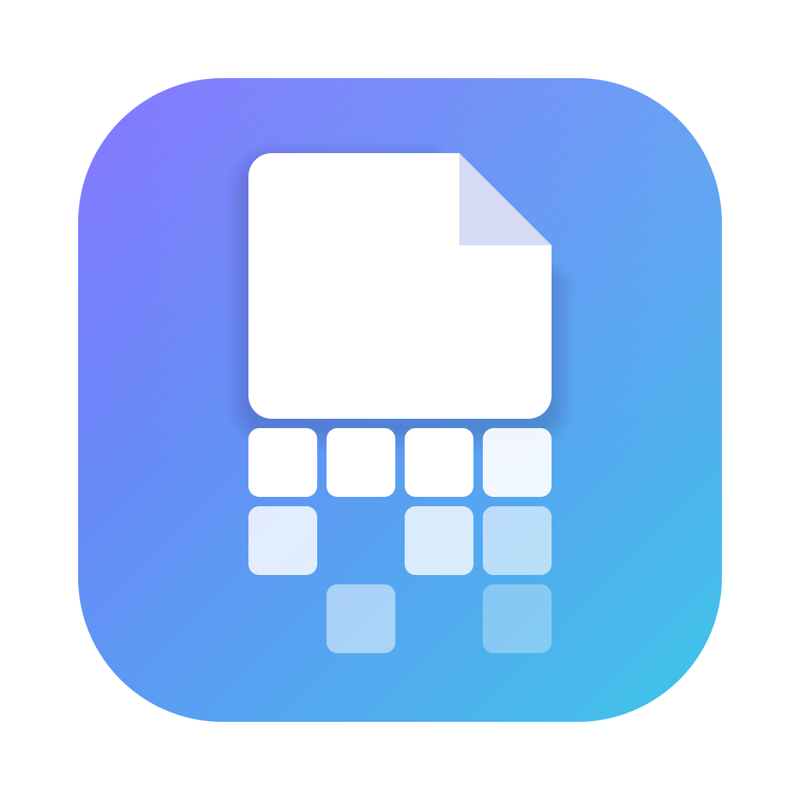
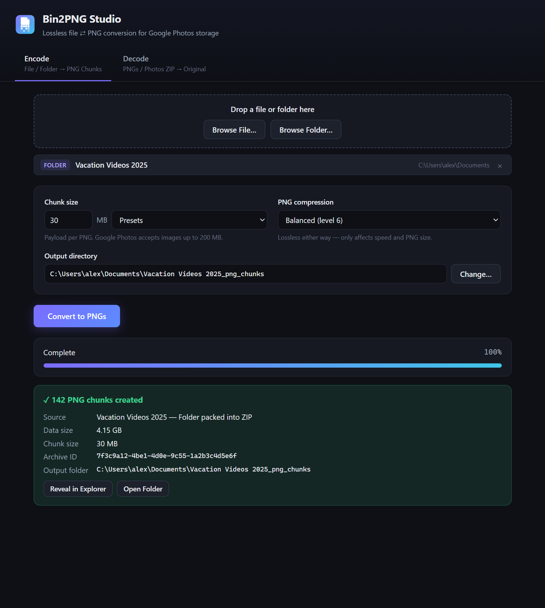
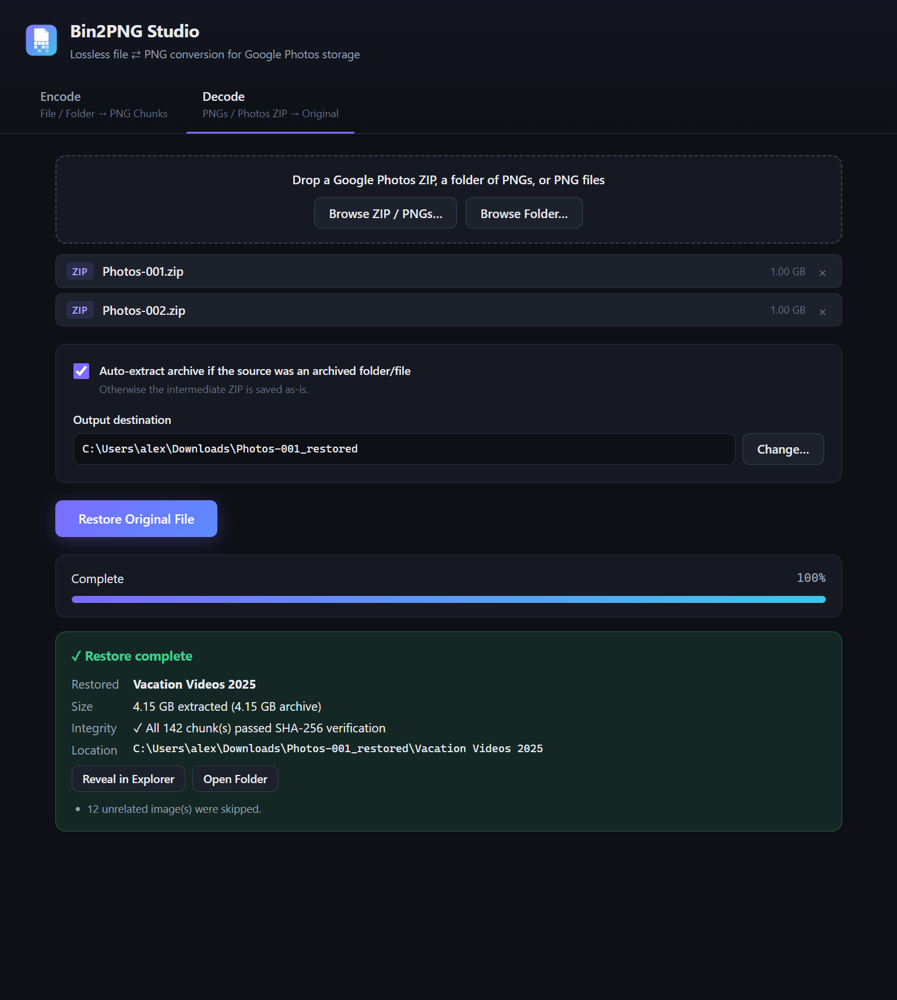

<div align="center">



# Bin2PNG Studio

**Store any file or folder in Google Photos as PNG images, and get it back byte-for-byte.**

[](../../releases/latest)


</div>

Bin2PNG Studio is a desktop app that converts **any file or folder** (videos, ISOs, archives, whole project folders) into ordinary-looking PNG images. You can upload those images to Google Photos (Some users might have unlimited storage there so that's the whole purpose of this coverter). Later you can turn them back into the exact original, straight from the ZIP Google Photos gives you when you download. Every chunk is checked with SHA-256, so you know the restore is bit-perfect.

<p align="center">
  
  
</p>

## Features

- **Any input:** single files of any type and size (20 GB+), whole folders, or existing `.zip` archives.
- **Lossless and verified:** each PNG carries a SHA-256 checksum. Missing or altered chunks are reported by number.
- **Restores directly from Google Photos downloads:** no need to unzip `Photos.zip` / Takeout parts first. Unrelated photos in the ZIP are skipped automatically.
- **File names don't matter:** chunks are identified by a header inside the pixels, so Google renaming uploads is fine, and chunks can arrive in any order.
- **Folder structure preserved:** folders are restored exactly as they were.
- **Low memory use:** data is streamed one chunk at a time.
- **Nothing to install:** a portable app for Windows, macOS and Linux that you just open.

## Download & run

Download the file for your system from [**Releases**](../../releases/latest). You don't need to install anything, including Node.js.

| System | File | How to run |
|---|---|---|
| **Windows** 10/11 (64-bit) | `bin2png-portable.exe` | Double-click it. |
| **macOS**, Apple Silicon (M1–M4) | `bin2png-mac-arm64.zip` | Unzip, then open **Bin2PNG Studio.app** (see note below). |
| **macOS**, Intel | `bin2png-mac-x64.zip` | Same as above. |
| **Linux** (64-bit) | `bin2png-linux-x86_64.AppImage` | `chmod +x bin2png-linux-*.AppImage`, then run it. |

> **Windows: "Windows protected your PC"?** The app isn't code-signed. Click **More info → Run anyway**. The portable exe unpacks itself on every launch, so startup takes a few seconds.
>
> **macOS: "app is damaged" or "can't be opened"?** The app isn't notarized by Apple. Move it to Applications and run this once in Terminal:
> ```bash
> xattr -cr "/Applications/Bin2PNG Studio.app"
> ```
> After that, open it normally.
>
> **Linux: AppImage won't start?** Some distros need FUSE 2. On Ubuntu 22.04+ that's `sudo apt install libfuse2`.

## How to use

### 1. Encode: file/folder → PNGs
1. Open the **Encode** tab. Drag in a file or folder, or use **Browse File… / Browse Folder…**.
2. Optionally change the **chunk size**. The default of 30 MB is a good choice; the maximum is 180 MB.
3. Click **Convert to PNGs**. The images go to `<name>_png_chunks/` next to the source.
4. Upload all the PNGs to Google Photos.

> ⚠️ **Important:** upload in **Original quality**, not *Storage saver*. Storage saver re-compresses images, which destroys the data. The app detects this, but the damaged chunks can't be recovered.

### 2. Decode: PNGs → original
1. Download the album or photos from Google Photos, which gives you a `.zip`.
2. Open the **Decode** tab and drop in the ZIP(s). A folder of PNGs or individual PNG files also works.
3. Click **Restore Original File**. With **Auto-extract** on (the default), you get your original folder or file back.

## Building from source

Requires [Node.js](https://nodejs.org/) 18+.

```bash
git clone <this-repo-url>
cd bin2png
npm install
npm start          # run the app in development
npm test           # run the round-trip tests
```

Build a standalone app:

| Command              | Output                                             |
|----------------------|----------------------------------------------------|
| `npm run dist:win`   | `dist/bin2png-portable.exe` (single-file portable) |
| `npm run dist:mac`   | `dist/bin2png-mac-x64.zip`, `dist/bin2png-mac-arm64.zip` |
| `npm run dist:linux` | `dist/bin2png-linux-x86_64.AppImage`               |

Each platform must be built on its own OS. The easy way is the included GitHub Actions workflow ([`.github/workflows/release.yml`](.github/workflows/release.yml)):

- **Release:** push a version tag (`git tag v1.0.1 && git push origin v1.0.1`). GitHub builds all three platforms and attaches them to a Release.
- **Test build:** on the **Actions** tab, choose **Build & Release → Run workflow**. The files appear as downloadable artifacts, and no release is created.

## How it works

<details>
<summary><b>Encoding</b></summary>

- **Folder, non-zip file, or multiple items:** packed into an *uncompressed* wrapper ZIP (with `archiver`) that preserves names and directory structure. The PNG step does the compressing. The wrapper is tagged with the ZIP comment `BIN2PNG-WRAPPER v1` so the decoder knows it can auto-extract it. It's written as a temp file first, because every chunk header records the total chunk count.
- **Existing `.zip`:** chunked as-is, without re-compression.
- **Each chunk** becomes a square 8-bit RGBA PNG (`pngjs`): `side = ceil(sqrt(ceil((72 + payload) / 4)))`. The remainder is padded with `0x00`.

</details>

<details>
<summary><b>Chunk header (first 72 bytes of each image's pixels)</b></summary>

| Bytes  | Field                                   |
|--------|-----------------------------------------|
| 0–7    | Magic `BIN2PNG\0`                       |
| 8–23   | File UUID (same for every chunk)        |
| 24–27  | Chunk index, `UInt32BE`, 0-based        |
| 28–31  | Total chunks, `UInt32BE`                |
| 32–39  | Payload length, `BigUInt64BE`           |
| 40–71  | SHA-256 of this chunk's payload         |
| 72+    | Payload, then zero padding              |

Each PNG also carries a small `iTXt` metadata chunk with the original name. It's optional: if it gets stripped, restoring still works and the output just gets a generic name.

</details>

<details>
<summary><b>Decoding</b></summary>

- Google Photos ZIPs are streamed with `yauzl`, one PNG entry at a time, without extracting the ZIP to disk.
- Each image is decoded, its magic and header are validated, and its payload SHA-256 is verified. The payload is then written straight to its final offset in the output, so this is a single pass in any order.
- Chunks are grouped by UUID, so several encoded archives can be mixed together. Each group is checked for gaps, trimmed to its exact size, and optionally extracted. Extraction guards against zip-slip and never overwrites existing files.

</details>

<details>
<summary><b>Architecture</b></summary>

- **Electron settings:** `contextIsolation: true`, `nodeIntegration: false`, `sandbox: true`. The UI only reaches a small API exposed by the preload script.
- **Background process:** all heavy work runs in an Electron `utilityProcess`, so the UI never freezes. Cancel kills it and removes temp and partial files.

```
src/
  main/
    main.js      window, dialogs, IPC, worker lifecycle
    worker.js    background process: runs encode/decode, reports progress
    encoder.js   file/folder → PNG chunks
    decoder.js   PNGs / ZIPs → original, verification, extraction
    header.js    72-byte binary header
    pngio.js     PNG encode/decode + metadata
  preload/
    preload.js   safe IPC bridge
  renderer/
    index.html, styles.css, app.js
  assets/
    icon.png     window icon + in-app logo
build/
  icon.png       app icon source for electron-builder (.ico/.icns)
scripts/
  make-icon.js   regenerates the icons (npm run icon)
test/
  roundtrip.test.js
```

</details>

## Limits

- **Disk space:** encoding a folder or non-zip file temporarily needs free space about equal to its size, for the wrapper ZIP.
- **Google Photos limits:** 200 MB and 150 megapixels per image. The 180 MB chunk cap (≈47 MP) keeps you under both.
- **Not a backup guarantee:** Google may change how it stores images. Keep another copy of anything important.

## License

[MIT](LICENSE)
